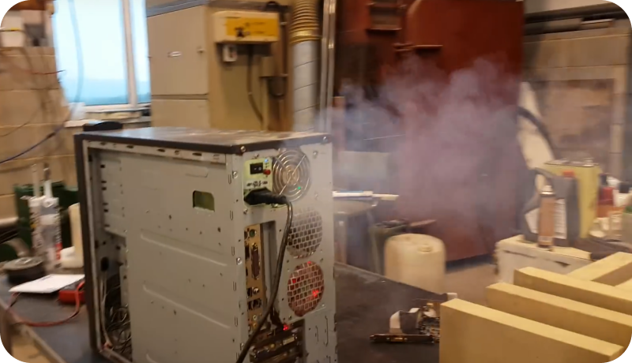

# `space_heater.c`

A simple program to heat up your room with your computer during the winter by
stressing all CPU cores on the system. I genuinely use this sometimes. It is
written in ANSI C, and can be compiled on both Windows and POSIX-compatible
systems.

## License
The code is licensed under the MIT License. See [`LICENSE`](LICENSE).

Credit for the banner goes to Luke Faichney's
[Computer Explodes!](https://www.youtube.com/watch?v=aJCb824tNKc)
video.
